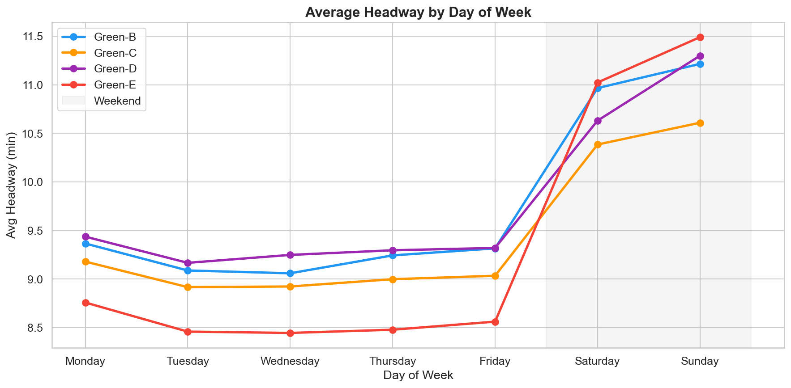
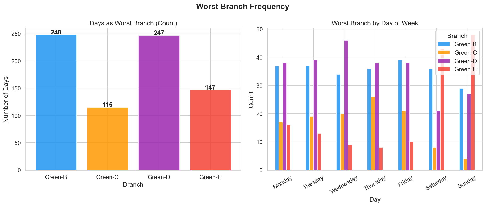
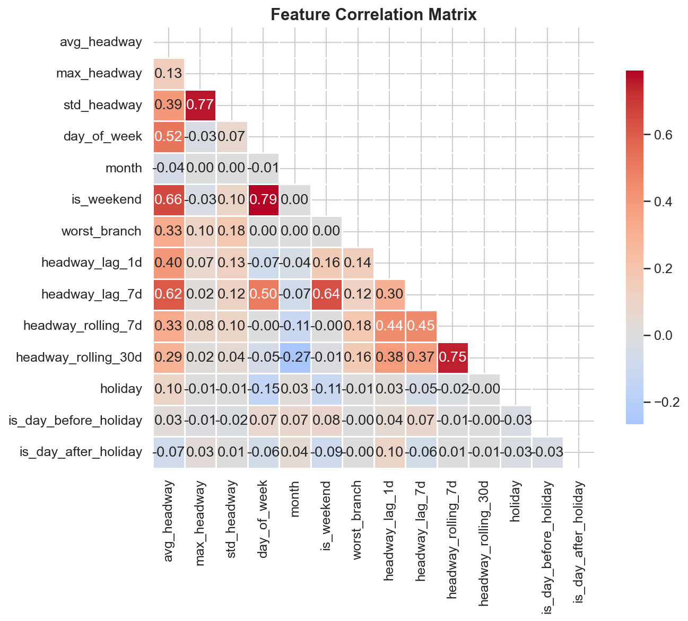
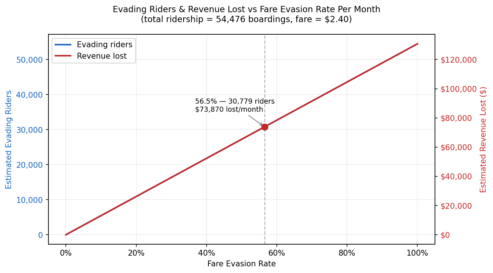
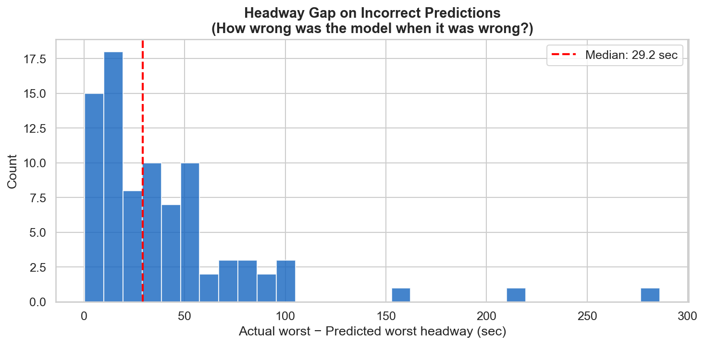
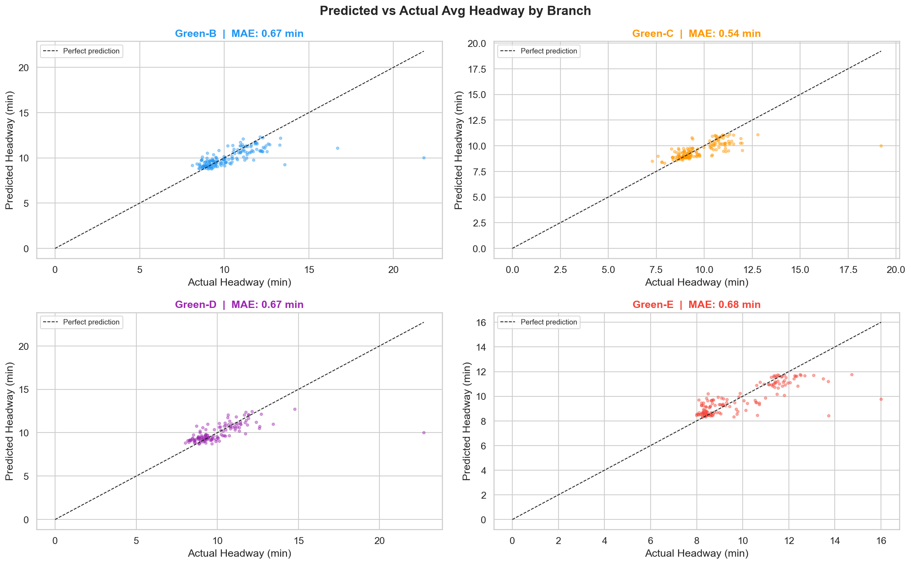

# Green-Line
## Green Line Branch Performance and Fare Evasion Estimation (CS506 Data Science Tools and Applications Project)

### Demo Video Link: [](http://youtube.com/watch?v=hdLFifqR8g4)

### How to build and run the code:

1) Clone repo and enter it

```bash
git clone git@github.com:joesteriti/Green-Line.git
cd "Final Project"
```

2) Create and activate a virtual environment

```bash
make setup
source .venv/bin/activate
make install
```

3) Set API key

- Copy `.env.example` to `.env`.
- Put your MBTA API key in `.env` as:

```bash
MBTA_API_KEY=your_real_key_here
```

You can request a key here: https://api-v3.mbta.com/

4) Download and place headway data

Download and unzip CSV files from:
- MBTA Rapid Transit Headways 2024: https://mbta-massdot.opendata.arcgis.com/datasets/ccb2941254944803bbd4e2df58e09906/about
- MBTA Rapid Transit Headways 2025: https://mbta-massdot.opendata.arcgis.com/datasets/84c9d171d32945f594fbb4d889153c44/about
- MBTA Rapid Transit Headways 2026: https://mbta-massdot.opendata.arcgis.com/datasets/fffd5e8ff7f042deb7834f3badf49e58/about

Expected folder layout:

```text
data/
  Headways_2024/
    2024-01_Headway.csv
    ...
    2024-12_Headway.csv
  Headways_2025/
    2025-01_Headway.csv
    ...
    2025-12_Headway.csv
  Headways_2026/
    2026-01_Headway.csv
    2026-02_Headway.csv
    2026-03_Headway.csv
```

5) Validate setup and run notebooks

```bash
make check
make notebook
```

Then run:
- `performance_model/performance_model.ipynb`
- `fare_evasion.ipynb`

### Tests:

- In `performance_model/performance_model.ipynb`, run all cells and confirm the tests section at the bottom passes.
- In `fare_evasion.ipynb`, run all cells and confirm the final tables/plots are generated.

### Visualizations:

There are a handful of visualizations in the notebooks, but I only included the ones I found most important in this report.


Purpose: To see if some branches have worse days than others or some days have worse headways than others


Purpose: To get an idea of which branches may suffer from longer headway


Purpose: To discover highly correlated features and take them out to reduce multicolinearity


Purpose: To give an idea of how much fare evasion and renvenue loss there is in a month given a lack of fare evasion rate data

### Description of data processing and model:

Data Processing:

The time series data was pulled directly from the MBTA and they were CSV files spanning January 2024 through March 2026, loaded in chucks for the four Green Line branches. Each record was a single train departure with direction, branch, and headway in seconds. After filtering, the trip-level records were aggregated to one row that represented one branch per day with mean, max, and standard deviation of headway. Temporal features like day of week, hour, rush hour, and holiday were obtained by timestamps. A weather dataframe containing precipitation, snowfall, windspeed, and other important weather features was created using Open-Meteo API and merged by date. Stop metadata was obtained through the MBTA v3 API to compute centroids for geographical analysis. Manual mapping of stops was required since there were no branch-level assignments, but there are only specific stops for each branch so that mapping took advantage of that fact. The final dataset contained features about weather, temporal and lag that were computed with deep consideration of data leakage

Feature Set:

There are a number of features used in this model. I will not list all of them, but a few main ones that had the most importance.

The single most important set of features that had the biggest improvement on model performance were the lag features. Up until that moment, the models were basically training on the same data so there wasn't much of a difference and prediction performance wasn't much better than random guessing. When I added the lag features, prediction performance improve by about 20% in accuracy and allows the model to actualy be a good predictor of headway irregularity.

Weather was the same way as it did improve performance, but a little less of an impact. It was hard to find a way to differeniate between different weather conditions as they are so close geographically.

The holiday feature and day before holiday feature was also a way to capture those one off days where it may impact headway performance as people may be using the branches more or less depending on if they are going to work or shop.

Model:

I used a XGBoost model for each of the 4 Green Line branches. XGBoost automatically handles features that are nonlinear like the lag features and weather through tree splits and other models would need a manual interaction term. Training branch-specific models rather than a single model (which I originally was planning to do) allows for the model to learn branch specific patterns using meaningful, unique information by branch to accurately predict headway.

I considered other models like random forest and ridge. Ridge struggles with nonlinear relationships and random forest doesn't correct errors from previous trees. Random forest would work almost as it reduces variance across independently built trees, but XGBoost improves by targeting residuals of previous trees which works well. I did not consider using a neural network. It may work better but I believed that it had diminishing returns on model performance and that a regression model with boosting would be sufficient given my situation.

I split the dataset into 80% training and 20% test. Due to it being time series data, I could not use a typical random split as it would cause data leakage so the split preserved temporal order. I used 5 fold cross-validation using the TimeSeriesSplit to preserve the order within the training set.

Using GridSearchCV, I found the best parameters for the model and used those best parameters to automatically refit the best model on the training data. I used 4 separate models to fit for each of the branches to get a numerical solution and scoring was MAE.

### Results:

My original goal was to predict the worst branch when it came to headway. As my project went on, I realized that I should just predict the headway for each branch, and then make classifications after if needed. It is more helpful to consumers and policy makers to know the actual values rather than the worst branch since they have access to more information. The goal was to make this useful in trying to determine whether to take one branch or another for consumers and trying to decide which branch to improve for policy makers/MBTA coordinators.

An example for why solely classifcation would be bad. Even in the case that some branch is worse than another, if the branch is 2 seconds worse but doesn't actually give the quantifiable results, it could be misleading which is why goals changed to predicting 

With that said, I still included a prediction of the worst branch which is around 40% accurate and the top 2 worst branches predicted is about 70% accurate. The more useful data is the continuous headway error (MAE) showing that the overall MAE is 38.3 seconds. 

Headway Distribution:

Continuous headway error (MAE):
Overall MAE: 38.3 sec (0.64 min)

Branch MAE (sec):
Green-C    32.5
Green-D    40.2
Green-B    40.4
Green-E    40.5



The median is 29.2 seconds. From a customer stand point, a less than 30 second error is acceptable when it comes to my daily commute. It is an error I am willing to incur for this model. If we look at the per branch breakdown for MAE of headway, we see that most 3 out of 4 branches hover around 40 second error compared to the actual headway recorded. Anything less than a minute would be acceptable in my standards and even in the 90th percentile, it is still less than a minute error.



Using this graph, the regression is pretty accurate given the data. Branch E suffers from a decent amount of outliers but the other branches fit very well according to this graphic.


Unfortunately, this is the goal that interested me the most, but did not have data to quantify the actual evasion rates. I found one article that is linked in the code that explained the evasion rate was about 56.5% for above ground stops. I heavily disagree with that considering I have never seen a single person pay on an above ground station. There is no way to confirm this as they do not have MBTA workers stationed at these stops that collect or enforce payment of fares. I would consider it a normal thing that above ground stops are considered "free" as there is no enforcement or repercussions for not paying the fares. This graph is the best I could come up with considering the data limitations. I've explained this in my check in meetings before. I think this graph could be used by policy makers to really quantify lost fares and see the potential of a better train system through adequate funding that they are not receiving due to nonenforcement of fare payments.
